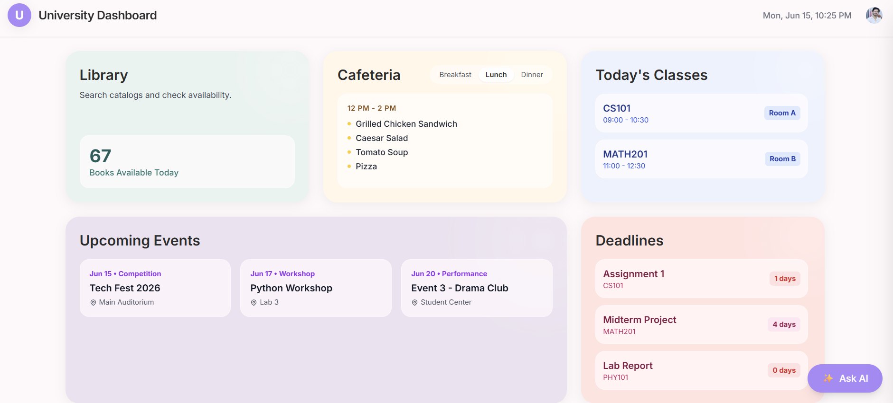
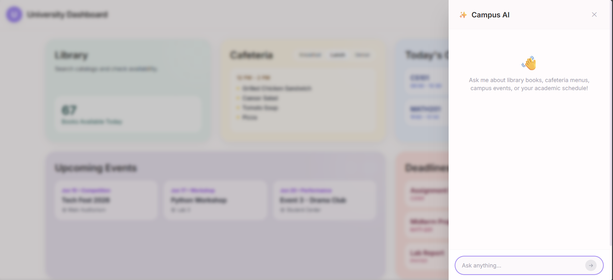
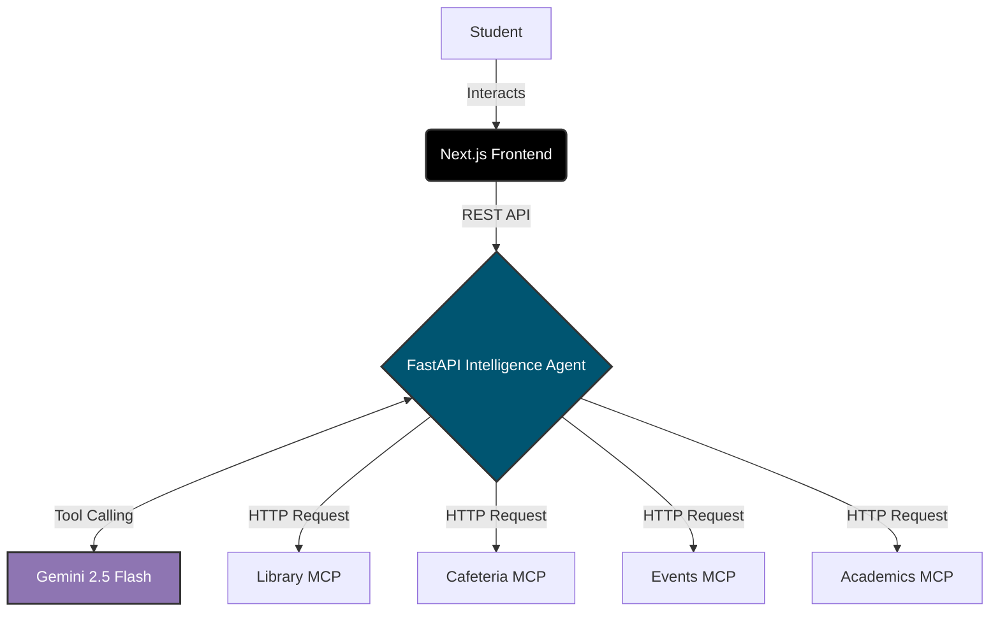

<div align="center">
  

  <h1 align="center">CampusIQ: Unified Campus Intelligence</h1>

  <p align="center">
    One place for everything happening on campus, supercharged by an AI Intelligence Agent.
    <br />
    <a href="https://campusiq-dashboard.vercel.app"><strong>View Live Demo »</strong></a>
    <br />
    <br />
    <a href="#features">Features</a>
    ·
    <a href="#architecture">Architecture</a>
    ·
    <a href="#tech-stack">Tech Stack</a>
  </p>
</div>

<div align="center">
  
  
  
  
  
  
  
</div>

---

## 📌 Project Overview

College campuses generate a massive amount of data every single day—scattered across legacy library portals, PDF cafeteria menus, scattered event boards, and disjointed academic systems. **CampusIQ unifies them all.**

Instead of building a massive, brittle centralized database, this platform relies on an **Agentic AI Architecture**. It implements independent, micro-MCP (Model Context Protocol) services for each domain. Our embedded **Intelligence Agent** acts as the orchestration layer, dynamically routing, querying, and synthesizing these services in real time based on natural language student requests.

## ✨ Features

* 🔐 **Secure Authentication:** Complete user management and secure routing powered by Clerk.
* 🧠 **Personalized Intelligence Agent:** A side-panel AI powered by Gemini 2.5 Flash that remembers your unique chat history and can reason across multiple campus domains simultaneously.
* 📊 **Unified Dashboard:** A beautiful, soft-minimalist UI that aggregates Library availability, Cafeteria menus, upcoming Events, and Academic deadlines at a glance.
* 🌐 **Decentralized Data:** Four fully independent FastAPI microservices acting as simulated data providers to replicate a real-world, fragmented campus IT ecosystem.
* ⚡ **Explainable AI:** Real-time visibility into the AI's internal reasoning and tool execution steps as it processes your requests.

## 📸 Dashboard Showcase

<div align="center">
  
  <br/>
  <em>The Embedded Intelligence Agent Drawer</em>
  <br/><br/>
  
  <br/>
  <em>The Main Unified Dashboard with Live Data Feeds</em>
</div>

## 🏗 Architecture

The system utilizes an AI Router pattern where the LLM dynamically decides which microservice to contact based on the user's intent.



## 🛠 Tech Stack

### Frontend Application
* **Framework:** Next.js 14 (App Router)
* **Language:** TypeScript
* **Styling:** Tailwind CSS (Soft Minimalist Aesthetic)
* **Auth:** Clerk (@clerk/nextjs)
* **Deployment:** Vercel

### Intelligence Agent & Backend Services
* **Framework:** FastAPI (Python)
* **AI Model:** Google Gemini 2.5 Flash
* **Memory Management:** SQLite with SQLAlchemy ORM
* **Architecture:** Model Context Protocol (MCP) Pattern
* **Deployment:** Railway (CI/CD connected to GitHub)

## 🚀 Local Development Setup

### Prerequisites
* Node.js & npm
* Python 3.9+
* A Gemini API Key
* Clerk Publishable & Secret Keys

### 1. Environment Variables
Create a `.env.local` file in `apps/frontend`:
```env
NEXT_PUBLIC_CLERK_PUBLISHABLE_KEY=your_key
CLERK_SECRET_KEY=your_secret
```

Create a `.env` file in `apps/intelligence-agent`:
```env
GEMINI_API_KEY=your_gemini_api_key_here
DATABASE_URL=sqlite:///./chat_history.db
```

### 2. Running the Ecosystem Locally
You will need to run the frontend, the intelligence agent, and the 4 backend MCP services. (In production, the Agent dynamically falls back to the live Railway URLs if local servers are unavailable).

**Start the Frontend:**
```bash
cd apps/frontend
npm install
npm run dev
```

**Start the Agent:**
```bash
cd apps/intelligence-agent
pip install -r requirements.txt
python main.py
```

**Start the MCP Services (Repeat for each folder):**
```bash
cd packages/library-mcp # (and cafeteria-mcp, events-mcp, academics-mcp)
pip install -r requirements.txt
python main.py
```


